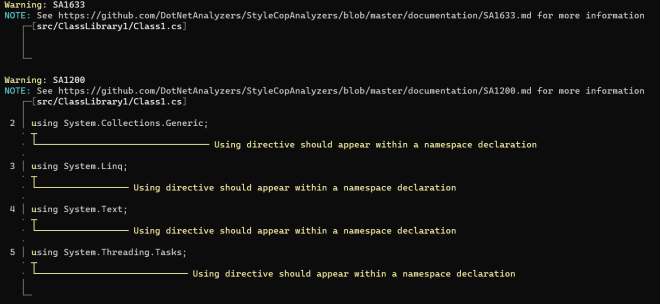
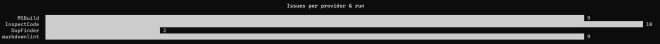
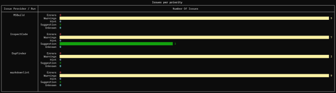

A new [Cake.Issues.Reporting.Console addin] has been released which allows to output issues to the console.

<!-- more -->

[Cake.Issues.Reporting.Console addin] can be used to print issues to the console and is built on top
of the excellent [Errata library](https://github.com/spectreconsole/errata){target="_blank"} by Patrik Svensson.

Its main focus is to annotate source code with issues:

It currently only supports issues containing line and column information.
Output can be grouped by rule, like in the image above, or individual entries for every issue.

Beside printing issues it can also show summary tables.

There's one summary which shows the number of issues for everyprovider and run:

Another summary shows the number of issues by priority for every provider and run:

[Cake.Issues.Reporting.Console addin]: ../../documentation/report-formats/console/index.md
