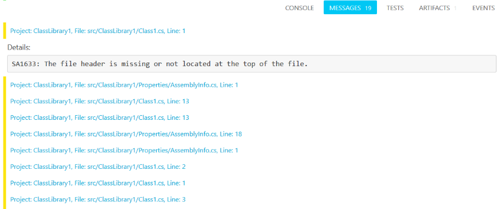

The [Cake.Issues.PullRequests.AppVeyor addin] reports issues as messages to AppVeyor builds.

!!! info
    There's a [demo repository] available which you can fork and to which you can create pull requests to test the integration functionality.

## Basic features

* Reports issues as messages to AppVeyor builds.
* Messages can be written as comment to GitHub pull requests.
  See [GitHub pull request integration] for an example.

## Supported capabilities

The [Cake.Issues.PullRequests.AppVeyor addin] doesn't support any additional capabilities.

|                  | Capability                     | Remarks                        |
|------------------|--------------------------------|--------------------------------|
|                  | Checking commit ID             |                                |
|                  | Discussion threads             |                                |
|                  | Filtering by modified files    |                                |

[demo repository]: https://github.com/pascalberger/Cake.Issues-Demo
[Cake.Issues.PullRequests.AppVeyor addin]: https://www.nuget.org/packages/Cake.Issues.PullRequests.AppVeyor
[GitHub pull request integration]: ./examples/github-pullrequest-integration.md
