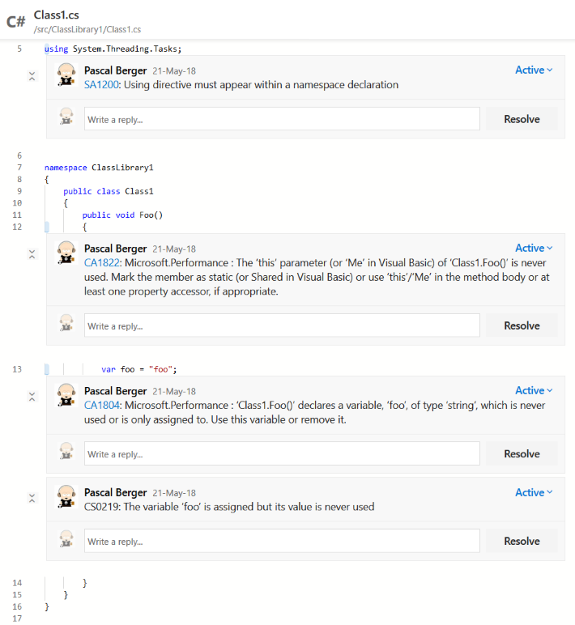

The [Cake.Issues.PullRequests.AzureDevOps addin](https://cakebuild.net/extensions/cake-issues-pullrequests-azuredevops/){target="_blank"}
provides the following features.

!!! info
    There's a [demo repository] available which you can fork and to which you can create pull requests to test the integration functionality.

## Basic features

* Writes issues as comments to [Azure DevOps](https://azure.microsoft.com/en-us/services/devops/){target="_blank"} pull requests.
* Identification of pull requests through source branch or pull request ID.
* Comments written by the addin will be rendered with a specific icon corresponding to the state of the issue.
* Adds rule number and, if provided by the issue provider, link to the rule description to the comment.
* Support for issues messages formatted in Markdown format.

## Supported capabilities

The [Cake.Issues.PullRequests.AzureDevOps addin](https://cakebuild.net/extensions/cake-issues-pullrequests-azuredevops/){target="_blank"}
supports all [Core features].

|                  | Capability                     | Remarks                        |
|------------------|--------------------------------|--------------------------------|
| :material-check: | Checking commit ID             |                                |
| :material-check: | Discussion threads             |                                |
| :material-check: | Filtering by modified files    |                                |

## Supported authentication methods

| Azure DevOps Server | Azure DevOps Service | Authentication method          |
|---------------------|----------------------|--------------------------------|
| :material-check:    |                      | NTLM                           |
| :material-check:    |                      | Basic authentication           |
| :material-check:    | :material-check:     | Personal access token          |
|                     | :material-check:     | OAuth                          |
|                     | :material-check:     | Azure Active Directory         |

For detailed instructions how to connect using the different methods see [Setup instructions].

[demo repository]: https://dev.azure.com/pberger/Cake.Issues-Demo
[Core features]: ../../overview/features.md#supported-core-functionality
[Setup instructions]: setup.md
