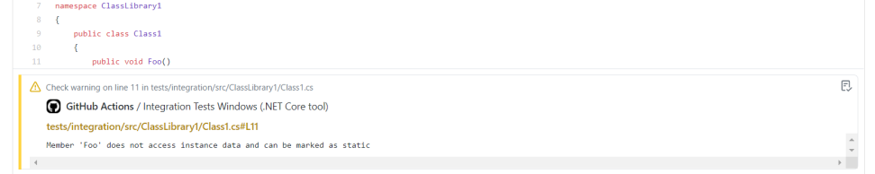

This example shows how to report issues as annotations to a GitHub Actions build.

To report issues as annotations to a GitHub Actions build you need to import the core addin,
the core pull request addin, the GitHub Actions support and one or more issue providers,
in this example for JetBrains InspectCode:

```csharp
#addin "Cake.Issues" // (1)!
#addin "Cake.Issues.InspectCode"
#addin "Cake.Issues.PullRequests"
#addin "Cake.Issues.PullRequests.GitHubActions"
```

--8<-- "snippets/pinning.md"

In the following task we'll first determine the remote repository URL and
source branch of the pull request and with this information call the
[GitHubActionsBuilds](https://cakebuild.net/api/Cake.Issues.PullRequests.GitHubActions/GitHubActionsBuildsAliases/){target="_blank"} alias:

```csharp
Task("ReportIssuesToGitHubActions").Does(() =>
{
    var repoRootFolder = MakeAbsolute(Directory("./"));

    ReportIssuesToPullRequest(
        InspectCodeIssuesFromFilePath(
            @"C:\build\inspectcode.log"),
        GitHubActionsBuilds(),
        repoRootFolder);
});
```

The output will show up in the build log grouped by issue provider / run:


Additionally the issues show up as annotations:


Having issues available as annotations also means that they will be shown in pull requests on the related file / position:


