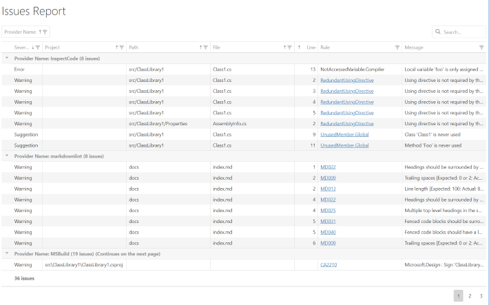

Template for a HTML report containing a rich data grid with sorting, filtering, grouping and search capabilities powered by [DevExtreme].



## Features

* Table with `Provider`, `Severity`, `Project`, `Path`, `File`, `Location`, `Rule`, `Message` by default.
* Support for grouping by multiple columns by user.
* Total number of issues by each group level.
* Each column sortable by user.
* Data can be filtered by any column by user.
* Paged view.
* Client-side full text search.
* Client-side export to Microsoft Excel or PDF.
* Fully customizable through [options](#options).

## Requirements

* Cake.Issues.Reporting.Generic 0.3.1 or higher

## Usage

To create a report using the HTML DevExtreme Data Grid template you can use the [GenericIssueReportTemplate.HtmlDxDataGrid] enum value:

```csharp
CreateIssueReport(
    issues,
    GenericIssueReportFormatFromEmbeddedTemplate(GenericIssueReportTemplate.HtmlDxDataGrid),
    @"c:\repo",
    @"c:\report.html");
```

## Options

See [HtmlDxDataGridOption] for a list of possible options.

## Demos

The following demo shows the template with its default options:

* [Default](htmldxdatagrid-demo-default.html){target="_blank"}
  ([Source Code](https://github.com/cake-contrib/Cake.Issues.Reporting.Generic/blob/develop/demos/script-runner/build/create-reports/create-reports-htmldxdatagrid-default.cake){target="_blank"})

### Themes

The template supports the teams defined in the [DevExtremeTheme] enumeration which can be set using the [HtmlDxDataGridOption.Theme]:

```csharp
CreateIssueReport(
    issues,
    GenericIssueReportFormatFromEmbeddedTemplate(
        GenericIssueReportTemplate.HtmlDxDataGrid,
        settings => settings.WithOption(HtmlDxDataGridOption.Theme, DevExtremeTheme.MaterialBlueLight)),
    @"c:\repo",
    @"c:\report.html");
```

* [Light Theme](htmldxdatagrid-demo-theme-light.html){target="_blank"}
  ([Source Code](https://github.com/cake-contrib/Cake.Issues.Reporting.Generic/blob/develop/demos/script-runner/build/create-reports/create-reports-htmldxdatagrid-theme-light.cake){target="_blank"})
* [Dark Theme](htmldxdatagrid-demo-theme-dark.html){target="_blank"}
  ([Source Code](https://github.com/cake-contrib/Cake.Issues.Reporting.Generic/blob/develop/demos/script-runner/build/create-reports/create-reports-htmldxdatagrid-theme-dark.cake){target="_blank"})
* [Contrast Theme](htmldxdatagrid-demo-theme-contrast.html){target="_blank"}
  ([Source Code](https://github.com/cake-contrib/Cake.Issues.Reporting.Generic/blob/develop/demos/script-runner/build/create-reports/create-reports-htmldxdatagrid-theme-contrast.cake){target="_blank"})
* [Carmine Theme](htmldxdatagrid-demo-theme-carmine.html){target="_blank"}
  ([Source Code](https://github.com/cake-contrib/Cake.Issues.Reporting.Generic/blob/develop/demos/script-runner/build/create-reports/create-reports-htmldxdatagrid-theme-carmine.cake){target="_blank"})
* [Dark Moon Theme](htmldxdatagrid-demo-theme-darkmoon.html){target="_blank"}
  ([Source Code](https://github.com/cake-contrib/Cake.Issues.Reporting.Generic/blob/develop/demos/script-runner/build/create-reports/create-reports-htmldxdatagrid-theme-darkmoon.cake){target="_blank"})
* [Soft Blue Theme](htmldxdatagrid-demo-theme-softblue.html){target="_blank"}
  ([Source Code](https://github.com/cake-contrib/Cake.Issues.Reporting.Generic/blob/develop/demos/script-runner/build/create-reports/create-reports-htmldxdatagrid-theme-softblue.cake){target="_blank"})
* [Dark Violet Theme](htmldxdatagrid-demo-theme-darkviolet.html){target="_blank"}
  ([Source Code](https://github.com/cake-contrib/Cake.Issues.Reporting.Generic/blob/develop/demos/script-runner/build/create-reports/create-reports-htmldxdatagrid-theme-darkviolet.cake){target="_blank"})
* [Green Mist Theme](htmldxdatagrid-demo-theme-greenmist.html){target="_blank"}
  ([Source Code](https://github.com/cake-contrib/Cake.Issues.Reporting.Generic/blob/develop/demos/script-runner/build/create-reports/create-reports-htmldxdatagrid-theme-greenmist.cake){target="_blank"})
* [Light Compact Theme](htmldxdatagrid-demo-theme-lightcompact.html){target="_blank"}
  ([Source Code](https://github.com/cake-contrib/Cake.Issues.Reporting.Generic/blob/develop/demos/script-runner/build/create-reports/create-reports-htmldxdatagrid-theme-lightcompact.cake){target="_blank"})
* [Dark Compact Theme](htmldxdatagrid-demo-theme-darkcompact.html){target="_blank"}
  ([Source Code](https://github.com/cake-contrib/Cake.Issues.Reporting.Generic/blob/develop/demos/script-runner/build/create-reports/create-reports-htmldxdatagrid-theme-darkcompact.cake){target="_blank"})
* [Contrast Compact Theme](htmldxdatagrid-demo-theme-contrastcompact.html){target="_blank"}
  ([Source Code](https://github.com/cake-contrib/Cake.Issues.Reporting.Generic/blob/develop/demos/script-runner/build/create-reports/create-reports-htmldxdatagrid-theme-contrastcompact.cake){target="_blank"})
* [Material Blue Light Theme](htmldxdatagrid-demo-theme-materialbluelight.html){target="_blank"}
  ([Source Code](https://github.com/cake-contrib/Cake.Issues.Reporting.Generic/blob/develop/demos/script-runner/build/create-reports/create-reports-htmldxdatagrid-theme-materialbluelight.cake){target="_blank"})
* [Material Lime Light Theme](htmldxdatagrid-demo-theme-materiallimelight.html){target="_blank"}
  ([Source Code](https://github.com/cake-contrib/Cake.Issues.Reporting.Generic/blob/develop/demos/script-runner/build/create-reports/create-reports-htmldxdatagrid-theme-materiallimelight.cake){target="_blank"})
* [Material Orange Light Theme](htmldxdatagrid-demo-theme-materialorangelight.html){target="_blank"}
  ([Source Code](https://github.com/cake-contrib/Cake.Issues.Reporting.Generic/blob/develop/demos/script-runner/build/create-reports/create-reports-htmldxdatagrid-theme-materialorangelight.cake){target="_blank"})
* [Material Purple Light Theme](htmldxdatagrid-demo-theme-materialpurplelight.html){target="_blank"}
  ([Source Code](https://github.com/cake-contrib/Cake.Issues.Reporting.Generic/blob/develop/demos/script-runner/build/create-reports/create-reports-htmldxdatagrid-theme-materialpurplelight.cake){target="_blank"})
* [Material Teal Light Theme](htmldxdatagrid-demo-theme-materialteallight.html){target="_blank"}
  ([Source Code](https://github.com/cake-contrib/Cake.Issues.Reporting.Generic/blob/develop/demos/script-runner/build/create-reports/create-reports-htmldxdatagrid-theme-materialteallight.cake){target="_blank"})
* [Material Blue Dark Theme](htmldxdatagrid-demo-theme-materialbluedark.html){target="_blank"}
  ([Source Code](https://github.com/cake-contrib/Cake.Issues.Reporting.Generic/blob/develop/demos/script-runner/build/create-reports/create-reports-htmldxdatagrid-theme-materialbluedark.cake){target="_blank"})
* [Material Lime Dark Theme](htmldxdatagrid-demo-theme-materiallimedark.html){target="_blank"}
  ([Source Code](https://github.com/cake-contrib/Cake.Issues.Reporting.Generic/blob/develop/demos/script-runner/build/create-reports/create-reports-htmldxdatagrid-theme-materiallimedark.cake){target="_blank"})
* [Material Orange Dark Theme](htmldxdatagrid-demo-theme-materialorangedark.html){target="_blank"}
  ([Source Code](https://github.com/cake-contrib/Cake.Issues.Reporting.Generic/blob/develop/demos/script-runner/build/create-reports/create-reports-htmldxdatagrid-theme-materialorangedark.cake){target="_blank"})
* [Material Purple Dark Theme](htmldxdatagrid-demo-theme-materialpurpledark.html){target="_blank"}
  ([Source Code](https://github.com/cake-contrib/Cake.Issues.Reporting.Generic/blob/develop/demos/script-runner/build/create-reports/create-reports-htmldxdatagrid-theme-materialpurpledark.cake){target="_blank"})
* [Material Teal Dark Theme](htmldxdatagrid-demo-theme-materialtealdark.html){target="_blank"}
  ([Source Code](https://github.com/cake-contrib/Cake.Issues.Reporting.Generic/blob/develop/demos/script-runner/build/create-reports/create-reports-htmldxdatagrid-theme-materialtealdark.cake){target="_blank"})
* [Material Blue Light Compact Theme](htmldxdatagrid-demo-theme-materialbluelightcompact.html){target="_blank"}
  ([Source Code](https://github.com/cake-contrib/Cake.Issues.Reporting.Generic/blob/develop/demos/script-runner/build/create-reports/create-reports-htmldxdatagrid-theme-materialbluelightcompact.cake){target="_blank"})
* [Material Lime Light Compact Theme](htmldxdatagrid-demo-theme-materiallimelightcompact.html){target="_blank"}
  ([Source Code](https://github.com/cake-contrib/Cake.Issues.Reporting.Generic/blob/develop/demos/script-runner/build/create-reports/create-reports-htmldxdatagrid-theme-materiallimelightcompact.cake){target="_blank"})
* [Material Orange Light Compact Theme](htmldxdatagrid-demo-theme-materialorangelightcompact.html){target="_blank"}
  ([Source Code](https://github.com/cake-contrib/Cake.Issues.Reporting.Generic/blob/develop/demos/script-runner/build/create-reports/create-reports-htmldxdatagrid-theme-materialorangelightcompact.cake){target="_blank"})
* [Material Purple Light Compact Theme](htmldxdatagrid-demo-theme-materialpurplelightcompact.html){target="_blank"}
  ([Source Code](https://github.com/cake-contrib/Cake.Issues.Reporting.Generic/blob/develop/demos/script-runner/build/create-reports/create-reports-htmldxdatagrid-theme-materialpurplelightcompact.cake){target="_blank"})
* [Material Teal Light Compact Theme](htmldxdatagrid-demo-theme-materialteallightcompact.html){target="_blank"}
  ([Source Code](https://github.com/cake-contrib/Cake.Issues.Reporting.Generic/blob/develop/demos/script-runner/build/create-reports/create-reports-htmldxdatagrid-theme-materialteallightcompact.cake){target="_blank"})
* [Material Blue Dark Compact Theme](htmldxdatagrid-demo-theme-materialbluedarkcompact.html){target="_blank"}
  ([Source Code](https://github.com/cake-contrib/Cake.Issues.Reporting.Generic/blob/develop/demos/script-runner/build/create-reports/create-reports-htmldxdatagrid-theme-materialbluedarkcompact.cake){target="_blank"})
* [Material Lime Dark Compact Theme](htmldxdatagrid-demo-theme-materiallimedarkcompact.html){target="_blank"}
  ([Source Code](https://github.com/cake-contrib/Cake.Issues.Reporting.Generic/blob/develop/demos/script-runner/build/create-reports/create-reports-htmldxdatagrid-theme-materiallimedarkcompact.cake){target="_blank"})
* [Material Orange Dark Compact Theme](htmldxdatagrid-demo-theme-materialorangedarkcompact.html){target="_blank"}
  ([Source Code](https://github.com/cake-contrib/Cake.Issues.Reporting.Generic/blob/develop/demos/script-runner/build/create-reports/create-reports-htmldxdatagrid-theme-materialorangedarkcompact.cake){target="_blank"})
* [Material Purple Dark Compact Theme](htmldxdatagrid-demo-theme-materialpurpledarkcompact.html){target="_blank"}
  ([Source Code](https://github.com/cake-contrib/Cake.Issues.Reporting.Generic/blob/develop/demos/script-runner/build/create-reports/create-reports-htmldxdatagrid-theme-materialpurpledarkcompact.cake){target="_blank"})
* [Material Teal Dark Compact Theme](htmldxdatagrid-demo-theme-materialtealdarkcompact.html){target="_blank"}
  ([Source Code](https://github.com/cake-contrib/Cake.Issues.Reporting.Generic/blob/develop/demos/script-runner/build/create-reports/create-reports-htmldxdatagrid-theme-materialtealdarkcompact.cake){target="_blank"})

### Column visibility

Visible columns can be defined using the `ColumnNameVisible` option:

```csharp
CreateIssueReport(
    issues,
    GenericIssueReportFormatFromEmbeddedTemplate(
        GenericIssueReportTemplate.HtmlDxDataGrid,
        settings => settings.WithOption(HtmlDxDataGridOption.LineVisible, false)),
    @"c:\repo",
    @"c:\report.html");
```

Additional columns can be added using the [HtmlDxDataGridOption.AdditionalColumns] option.

* [Show and hide columns](htmldxdatagrid-demo-columnhiding.html)
  ([Source Code](https://github.com/cake-contrib/Cake.Issues.Reporting.Generic/blob/develop/demos/script-runner/build/create-reports/create-reports-htmldxdatagrid-hide-columns.cake))
* [Add additional columns](htmldxdatagrid-demo-additionalcolumns.html)
  ([Source Code](https://github.com/cake-contrib/Cake.Issues.Reporting.Generic/blob/develop/demos/script-runner/build/create-reports/create-reports-htmldxdatagrid-additional-columns.cake))

### Sorting

Sorted columns can be defined using the [HtmlDxDataGridOption.SortedColumns] and the
`ColumnNameSortOder` options:

```csharp
CreateIssueReport(
    issues,
    GenericIssueReportFormatFromEmbeddedTemplate(
        GenericIssueReportTemplate.HtmlDxDataGrid,
        settings => settings
            .WithOption(HtmlDxDataGridOption.SortedColumns, new List<ReportColumn> { ReportColumn.RuleId })
            .WithOption(HtmlDxDataGridOption.RuleIdSortOder, ColumnSortOderDescending )),
    @"c:\repo",
    @"c:\report.html");
```

* [Change sorting](htmldxdatagrid-demo-sorting.html){target="_blank"}
  ([Source Code](https://github.com/cake-contrib/Cake.Issues.Reporting.Generic/blob/develop/demos/script-runner/build/create-reports/create-reports-htmldxdatagrid-sorting.cake){target="_blank"})

### Grouping

Grouping can be defined using the [HtmlDxDataGridOption.GroupedColumns] option:

```csharp
CreateIssueReport(
    issues,
    GenericIssueReportFormatFromEmbeddedTemplate(
        GenericIssueReportTemplate.HtmlDxDataGrid,
        settings => settings.WithOption(HtmlDxDataGridOption.GroupedColumns, new List<ReportColumn> { ReportColumn.RuleId })),
    @"c:\repo",
    @"c:\report.html");
```

* [Change grouping](htmldxdatagrid-demo-grouping.html){target="_blank"}
  ([Source Code](https://github.com/cake-contrib/Cake.Issues.Reporting.Generic/blob/develop/demos/script-runner/build/create-reports/create-reports-htmldxdatagrid-grouping.cake){target="_blank"})
* [Disable grouping](htmldxdatagrid-demo-disablegrouping.html){target="_blank"}
  ([Source Code](https://github.com/cake-contrib/Cake.Issues.Reporting.Generic/blob/develop/demos/script-runner/build/create-reports/create-reports-htmldxdatagrid-disable-grouping.cake){target="_blank"})

### Exporting

Exporting can be enabled using the [HtmlDxDataGridOption.EnableExporting] option:

```csharp
CreateIssueReport(
    issues,
    GenericIssueReportFormatFromEmbeddedTemplate(
        GenericIssueReportTemplate.HtmlDxDataGrid,
        settings => settings.WithOption(HtmlDxDataGridOption.EnableExporting, true)),
    @"c:\repo",
    @"c:\report.html");
```

* [Enable exporting](htmldxdatagrid-demo-enableexporting.html){target="_blank"}
  ([Source Code](https://github.com/cake-contrib/Cake.Issues.Reporting.Generic/blob/develop/demos/script-runner/build/create-reports/create-reports-htmldxdatagrid-enable-exporting.cake){target="_blank"})
* [Microsoft Excel export (*.xlsx)](htmldxdatagrid-demo-exportformat-xlsx.html){target="_blank"}
  ([Source Code](https://github.com/cake-contrib/Cake.Issues.Reporting.Generic/blob/develop/demos/script-runner/build/create-reports/create-reports-htmldxdatagrid-exportformat-xlsx.cake){target="_blank"})
* [PDF export (*.pdf)](htmldxdatagrid-demo-exportformat-pdf.html){target="_blank"}
  ([Source Code](https://github.com/cake-contrib/Cake.Issues.Reporting.Generic/blob/develop/demos/script-runner/build/create-reports/create-reports-htmldxdatagrid-exportformat-pdf.cake){target="_blank"})
* [Custom export file name](htmldxdatagrid-demo-customexportfilename.html){target="_blank"}
  ([Source Code](https://github.com/cake-contrib/Cake.Issues.Reporting.Generic/blob/develop/demos/script-runner/build/create-reports/create-reports-htmldxdatagrid-custom-export-filename.cake){target="_blank"})

### Other features

* [Change title](htmldxdatagrid-demo-changetitle.html){target="_blank"}
  ([Source Code](https://github.com/cake-contrib/Cake.Issues.Reporting.Generic/blob/develop/demos/script-runner/build/create-reports/create-reports-htmldxdatagrid-change-title.cake){target="_blank"})
* [Disable header](htmldxdatagrid-demo-disableheader.html){target="_blank"}
  ([Source Code](https://github.com/cake-contrib/Cake.Issues.Reporting.Generic/blob/develop/demos/script-runner/build/create-reports/create-reports-htmldxdatagrid-disable-header.cake){target="_blank"})
* [Disable filtering](htmldxdatagrid-demo-disablefiltering.html){target="_blank"}
  ([Source Code](https://github.com/cake-contrib/Cake.Issues.Reporting.Generic/blob/develop/demos/script-runner/build/create-reports/create-reports-htmldxdatagrid-disable-filtering.cake){target="_blank"})
* [Disable searching](htmldxdatagrid-demo-disablesearching.html){target="_blank"}
  ([Source Code](https://github.com/cake-contrib/Cake.Issues.Reporting.Generic/blob/develop/demos/script-runner/build/create-reports/create-reports-htmldxdatagrid-disable-searching.cake){target="_blank"})
* [Custom script location and version](htmldxdatagrid-demo-customscriptlocation.html){target="_blank"}
  ([Source Code](https://github.com/cake-contrib/Cake.Issues.Reporting.Generic/blob/develop/demos/script-runner/build/create-reports/create-reports-htmldxdatagrid-custom-script-location.cake){target="_blank"})

## Source Code

!!! info
    You can use the source code as a template for your [custom template].

Source code is available on [GitHub].

[DevExtreme]: https://js.devexpress.com
[GenericIssueReportTemplate.HtmlDxDataGrid]: https://cakebuild.net/api/Cake.Issues.Reporting.Generic/GenericIssueReportTemplate/0E9E9D94
[HtmlDxDataGridOption]: https://cakebuild.net/api/Cake.Issues.Reporting.Generic/HtmlDxDataGridOption/
[DevExtremeTheme]: https://cakebuild.net/api/Cake.Issues.Reporting.Generic/DevExtremeTheme/
[HtmlDxDataGridOption.Theme]: https://cakebuild.net/api/Cake.Issues.Reporting.Generic/HtmlDxDataGridOption/EA83DCAB
[HtmlDxDataGridOption.AdditionalColumns]: https://cakebuild.net/api/Cake.Issues.Reporting.Generic/HtmlDxDataGridOption/F9860912
[HtmlDxDataGridOption.SortedColumns]: https://cakebuild.net/api/Cake.Issues.Reporting.Generic/HtmlDxDataGridOption/D578E453
[HtmlDxDataGridOption.GroupedColumns]: https://cakebuild.net/api/Cake.Issues.Reporting.Generic/HtmlDxDataGridOption/0907599C
[HtmlDxDataGridOption.EnableExporting]: https://cakebuild.net/api/Cake.Issues.Reporting.Generic/HtmlDxDataGridOption/1441E285
[custom template]: ../examples/custom-template.md
[GitHub]: https://github.com/cake-contrib/Cake.Issues.Reporting.Generic/blob/develop/src/Cake.Issues.Reporting.Generic/Templates/DxDataGrid.cshtml
