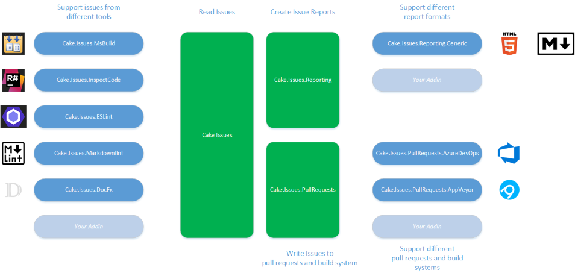

The Cake Issues addins are built in a modular architecture, allowing to easily
enhance it for supporting additional analyzers, linters, report formats and pull request systems.

The core consists of the following addins:

| Addin                    | Description                                                                                                                                                                                            |
|--------------------------|--------------------------------------------------------------------------------------------------------------------------------------------------------------------------------------------------------|
| Cake.Issues              | Provides aliases for creating issues or reading issues using one or more issue providers. Support for different code analyzers and linters can be provided through additional [issue provider] addins. |
| Cake.Issues.Reporting    | Provides aliases for creating reports for issues. Support for different report formats can be provided through additional [report format] addins.                                                      |
| Cake.Issues.PullRequests | Provides aliases for reporting issues as comments to pull requests. Support for different pull request systems can be provided through additional [pull request system] addins.                        |

[issue provider]: issue-provider
[report format]: report-format
[pull request system]: pull-request-system
