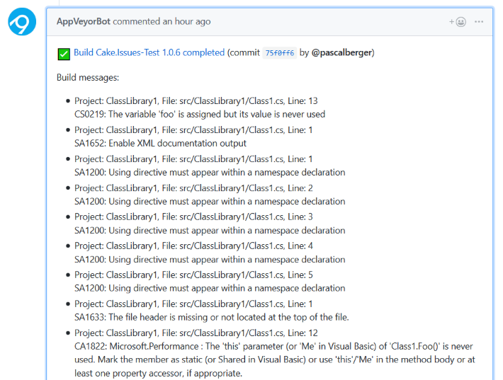

This example shows how to write AppVeyor messages created by Cake.Issues to GitHub pull requests.

Issues reported as messages to AppVeyor builds can be written to a GitHub pull request using [GitHub Pull Request Notification]
in your `appveyor.yml` file.

The following example will write a comment to the GitHub pull request containing all issues which were posted as message to the
AppVeyor build:

```yml
notifications:
- provider: GitHubPullRequest
  template: "{{#passed}}:white_check_mark:{{/passed}}{{#failed}}:x:{{/failed}} [Build {{&projectName}} {{buildVersion}} {{status}}]({{buildUrl}}) (commit {{commitUrl}} by @{{&commitAuthorUsername}})<p>Build messages:</p><ul>{{#jobs}}{{#messages}}<li>{{message}}<br/>{{details}}</li>{{/messages}}{{/jobs}}</ul>"
```

The output will look similar to this:



[GitHub Pull Request Notification]: https://www.appveyor.com/docs/notifications/#github-pull-request