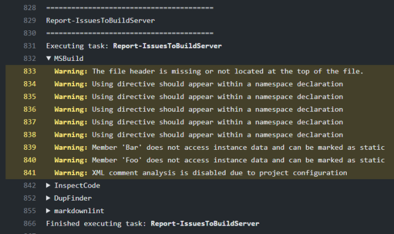
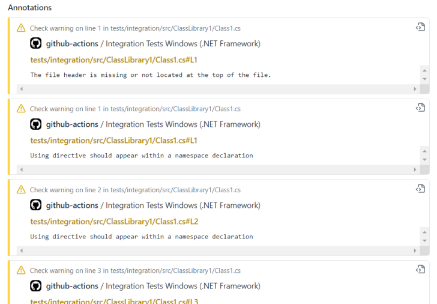

Version 0.4.2 of Cake Issues Recipe has been released bringing support for GitHub Actions.

<!--excerpt-->

This post shows the highlights included in this release.
For update instructions skip to [Updating from previous versions](#updating-from-previous-versions).

❤ Huge thanks to our community! This release would not have been possible without your support and contributions! ❤

People working on this release:

* [admiringworm](https://github.com/admiringworm)
* [pascalberger](https://github.com/pascalberger)

## Support for GitHub Actions

This version of Cake.Issues.Recipe brings support for running under GitHub Actions.
Currently supported feature is writing of issues to build server which will show up in the build log grouped by issue provider / run:

Additionally the issues show up as annotations:

Having issues available as annotations also means that they will be shown in pull requests on the related file / position:

It's planned to support remaining features like providing full issue report as artifact in a future release.

:::{.alert .alert-info}
Support for GitHub Actions integration is currently only available in Cake.Issues.Recipe, but not as a standalone addin.
It's planned to additionally provide a standalone addin which can be used outside of Cake.Issues.Recipe in the future.
:::

## Updating from previous versions

Cake.Issues.Recipe 0.4.2 is compatible with version 0.4.x without any breaking changes.
To update to the new version bump the version in your build script.
