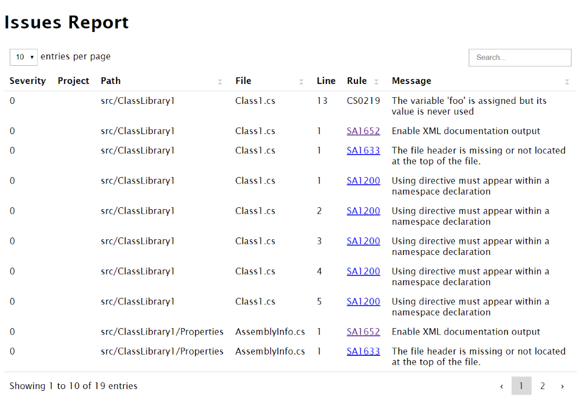

Template for a HTML report containing a rich data table view with sorting and search functionality powered by [Vanilla-DataTables].



# Features

* Separate table for issues of each issue provider.
* Table with `Severity`, `Project`, `Path`, `File`, `Line`, `Rule`, `Message`.
* Each column sortable by user.
* Paged table with possibility for user to change number of entries per page.
* Client-side full text search.
* No internet access required for displaying.

# Requirements

* Cake.Issues.Reporting.Generic 0.2.1 or higher

# Usage

To create a report using the HTML Data Table template you can use the [GenericIssueReportTemplate.HtmlDataTable] enum value:

```csharp
CreateIssueReport(
    issues,
    GenericIssueReportFormatFromEmbeddedTemplate(GenericIssueReportTemplate.HtmlDataTable),
    @"c:\repo",
    @"c:\report.html");
```

# Demos

* <a href="htmldatatable-demo-default.html" target="_blank">Default</a>

# Source Code

:::{.alert .alert-info}
You can use the source code as a template for your [custom template].
:::

Source code is available on [GitHub].

[Vanilla-DataTables]: https://github.com/Mobius1/Vanilla-DataTables
[GenericIssueReportTemplate.HtmlDataTable]: ../../../../../Cake.Issues.Website/api/Cake.Issues.Reporting.Generic/GenericIssueReportTemplate/62ADE81F
[custom template]: ../examples#use-custom-template
[GitHub]: https://github.com/cake-contrib/Cake.Issues.Reporting.Generic/blob/develop/src/Cake.Issues.Reporting.Generic/Templates/DataTable.cshtml
