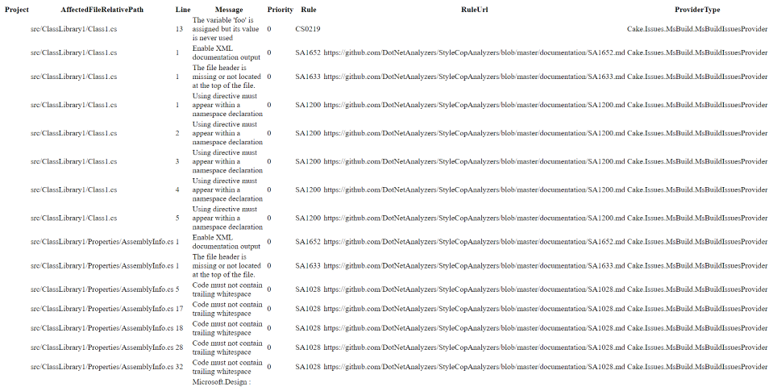

Template for a HTML report containing a list of all issues with all properties.



# Features

* Unstyled table listing all properties of [IIssue]
* No internet access required for displaying.

# Requirements

* No additional requirements.

# Usage

To create a report using the HTML diagnostic template you can use the [GenericIssueReportTemplate.HtmlDiagnostic] enum value:

```csharp
CreateIssueReport(
    issues,
    GenericIssueReportFormatFromEmbeddedTemplate(GenericIssueReportTemplate.HtmlDiagnostic),
    @"c:\repo",
    @"c:\report.html");
```

# Demos

* <a href="htmldiagnostic-demo.html" target="_blank">Default</a>

# Source Code

:::{.alert .alert-info}
You can use the source code as a template for your [custom template].
:::

Source code is available on [GitHub].

[IIssue]: ../../../../../Cake.Issues.Website/api/Cake.Issues/IIssue/
[GenericIssueReportTemplate.HtmlDiagnostic]: ../../../../../Cake.Issues.Website/api/Cake.Issues.Reporting.Generic/GenericIssueReportTemplate/4F88BD05
[custom template]: ../examples#use-custom-template
[GitHub]: https://github.com/cake-contrib/Cake.Issues.Reporting.Generic/blob/develop/src/Cake.Issues.Reporting.Generic/Templates/Diagnostic.cshtml