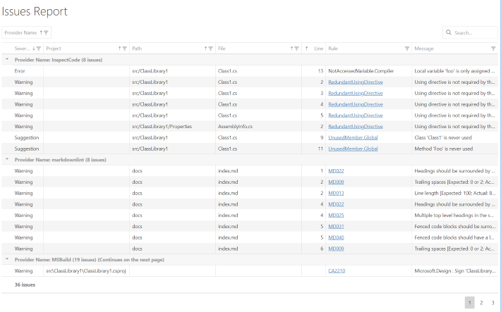

Template for a HTML report containing a rich data grid with sorting, filtering, grouping and search capabilities powered by [DevExtreme].



# Features

* Table with `Provider`, `Severity`, `Project`, `Path`, `File`, `Line`, `Rule`, `Message` by default.
* Support for grouping by multiple columns by user.
* Total number of issues by each group level.
* Each column sortable by user.
* Data can be filtered by any column by user.
* Paged view.
* Client-side full text search.
* Fully customizable through [options](#options).

# Requirements

* Cake.Issues.Reporting.Generic 0.3.1 or higher
* Internet access

# Usage

To create a report using the HTML DevExtreme Data Grid template you can use the [GenericIssueReportTemplate.HtmlDxDataGrid] enum value:

```csharp
CreateIssueReport(
    issues,
    GenericIssueReportFormatFromEmbeddedTemplate(GenericIssueReportTemplate.HtmlDxDataGrid),
    @"c:\repo",
    @"c:\report.html");
```

# Options

See [HtmlDxDataGridOption] for a list of possible options.

# Demos

The following demo shows the template with its default options:

* <a href="htmldxdatagrid-demo-default.html" target="_blank">Default</a>
  (<a href="https://github.com/cake-contrib/Cake.Issues.Website/blob/develop/demos/build/create-reports/create-reports-htmldxdatagrid-default.cake" target="_blank">Source Code</a>)

## Themes

The template supports the teams defined in the [DevExtremeTheme] enumeration which can be set using the [HtmlDxDataGridOption.Theme]:

```csharp
CreateIssueReport(
    issues,
    GenericIssueReportFormatFromEmbeddedTemplate(
        GenericIssueReportTemplate.HtmlDxDataGrid,
        settings => settings.WithOption(HtmlDxDataGridOption.Theme, DevExtremeTheme.MaterialBlueLight)),
    @"c:\repo",
    @"c:\report.html");
```

* <a href="htmldxdatagrid-demo-theme-light.html" target="_blank">Light Theme</a>
  (<a href="https://github.com/cake-contrib/Cake.Issues.Website/blob/develop/demos/build/create-reports/create-reports-htmldxdatagrid-theme-light.cake" target="_blank">Source Code</a>)
* <a href="htmldxdatagrid-demo-theme-dark.html" target="_blank">Dark Theme</a>
  (<a href="https://github.com/cake-contrib/Cake.Issues.Website/blob/develop/demos/build/create-reports/create-reports-htmldxdatagrid-theme-dark.cake" target="_blank">Source Code</a>)
* <a href="htmldxdatagrid-demo-theme-contrast.html" target="_blank">Contrast Theme</a>
  (<a href="https://github.com/cake-contrib/Cake.Issues.Website/blob/develop/demos/build/create-reports/create-reports-htmldxdatagrid-theme-contrast.cake" target="_blank">Source Code</a>)
* <a href="htmldxdatagrid-demo-theme-carmine.html" target="_blank">Carmine Theme</a>
  (<a href="https://github.com/cake-contrib/Cake.Issues.Website/blob/develop/demos/build/create-reports/create-reports-htmldxdatagrid-theme-carmine.cake" target="_blank">Source Code</a>)
* <a href="htmldxdatagrid-demo-theme-darkmoon.html" target="_blank">Dark Moon Theme</a>
  (<a href="https://github.com/cake-contrib/Cake.Issues.Website/blob/develop/demos/build/create-reports/create-reports-htmldxdatagrid-theme-darkmoon.cake" target="_blank">Source Code</a>)
* <a href="htmldxdatagrid-demo-theme-softblue.html" target="_blank">Soft Blue Theme</a>
  (<a href="https://github.com/cake-contrib/Cake.Issues.Website/blob/develop/demos/build/create-reports/create-reports-htmldxdatagrid-theme-softblue.cake" target="_blank">Source Code</a>)
* <a href="htmldxdatagrid-demo-theme-darkviolet.html" target="_blank">Dark Violet Theme</a>
  (<a href="https://github.com/cake-contrib/Cake.Issues.Website/blob/develop/demos/build/create-reports/create-reports-htmldxdatagrid-theme-darkviolet.cake" target="_blank">Source Code</a>)
* <a href="htmldxdatagrid-demo-theme-greenmist.html" target="_blank">Green Mist Theme</a>
  (<a href="https://github.com/cake-contrib/Cake.Issues.Website/blob/develop/demos/build/create-reports/create-reports-htmldxdatagrid-theme-greenmist.cake" target="_blank">Source Code</a>)
* <a href="htmldxdatagrid-demo-theme-lightcompact.html" target="_blank">Light Compact Theme</a>
  (<a href="https://github.com/cake-contrib/Cake.Issues.Website/blob/develop/demos/build/create-reports/create-reports-htmldxdatagrid-theme-lightcompact.cake" target="_blank">Source Code</a>)
* <a href="htmldxdatagrid-demo-theme-darkcompact.html" target="_blank">Dark Compact Theme</a>
  (<a href="https://github.com/cake-contrib/Cake.Issues.Website/blob/develop/demos/build/create-reports/create-reports-htmldxdatagrid-theme-darkcompact.cake" target="_blank">Source Code</a>)
* <a href="htmldxdatagrid-demo-theme-contrastcompact.html" target="_blank">Contrast Compact Theme</a>
  (<a href="https://github.com/cake-contrib/Cake.Issues.Website/blob/develop/demos/build/create-reports/create-reports-htmldxdatagrid-theme-contrastcompact.cake" target="_blank">Source Code</a>)
* <a href="htmldxdatagrid-demo-theme-materialbluelight.html" target="_blank">Material Blue Light Theme</a>
  (<a href="https://github.com/cake-contrib/Cake.Issues.Website/blob/develop/demos/build/create-reports/create-reports-htmldxdatagrid-theme-materialbluelight.cake" target="_blank">Source Code</a>)
* <a href="htmldxdatagrid-demo-theme-materiallimelight.html" target="_blank">Material Lime Light Theme</a>
  (<a href="https://github.com/cake-contrib/Cake.Issues.Website/blob/develop/demos/build/create-reports/create-reports-htmldxdatagrid-theme-materiallimelight.cake" target="_blank">Source Code</a>)
* <a href="htmldxdatagrid-demo-theme-materialorangelight.html" target="_blank">Material Orange Light Theme</a>
  (<a href="https://github.com/cake-contrib/Cake.Issues.Website/blob/develop/demos/build/create-reports/create-reports-htmldxdatagrid-theme-materialorangelight.cake" target="_blank">Source Code</a>)
* <a href="htmldxdatagrid-demo-theme-materialpurplelight.html" target="_blank">Material Purple Light Theme</a>
  (<a href="https://github.com/cake-contrib/Cake.Issues.Website/blob/develop/demos/build/create-reports/create-reports-htmldxdatagrid-theme-materialpurplelight.cake" target="_blank">Source Code</a>)
* <a href="htmldxdatagrid-demo-theme-materialteallight.html" target="_blank">Material Teal Light Theme</a>
  (<a href="https://github.com/cake-contrib/Cake.Issues.Website/blob/develop/demos/build/create-reports/create-reports-htmldxdatagrid-theme-materialteallight.cake" target="_blank">Source Code</a>)

## Column visibility

Visible columns can be defined using the `ColumnNameVisible` option:

```csharp
CreateIssueReport(
    issues,
    GenericIssueReportFormatFromEmbeddedTemplate(
        GenericIssueReportTemplate.HtmlDxDataGrid,
        settings => settings.WithOption(HtmlDxDataGridOption.LineVisible, false)),
    @"c:\repo",
    @"c:\report.html");
```

Additional columns can be added using the `AdditionalColumns` option.

* <a href="htmldxdatagrid-demo-columnhiding.html" target="_blank">Show and hide columns</a>
  (<a href="https://github.com/cake-contrib/Cake.Issues.Website/blob/develop/demos/build/create-reports/create-reports-htmldxdatagrid-hide-columns.cake" target="_blank">Source Code</a>)
* <a href="htmldxdatagrid-demo-additionalcolumns.html" target="_blank">Add additional columns</a>
  (<a href="https://github.com/cake-contrib/Cake.Issues.Website/blob/develop/demos/build/create-reports/create-reports-htmldxdatagrid-additional-columns.cake" target="_blank">Source Code</a>)

## Sorting

Sorted columns can be defined using the [HtmlDxDataGridOption.SortedColumns] and the
`ColumnNameSortOder` options:

```csharp
CreateIssueReport(
    issues,
    GenericIssueReportFormatFromEmbeddedTemplate(
        GenericIssueReportTemplate.HtmlDxDataGrid,
        settings => settings
            .WithOption(HtmlDxDataGridOption.SortedColumns, new List<ReportColumn> { ReportColumn.Rule })
            .WithOption(HtmlDxDataGridOption.RuleSortOder, ColumnSortOderDescending )),
    @"c:\repo",
    @"c:\report.html");
```

* <a href="htmldxdatagrid-demo-sorting.html" target="_blank">Change sorting</a>
  (<a href="https://github.com/cake-contrib/Cake.Issues.Website/blob/develop/demos/build/create-reports/create-reports-htmldxdatagrid-sorting.cake" target="_blank">Source Code</a>)

## Grouping

Grouping can be defined using the [HtmlDxDataGridOption.GroupedColumns] option:

```csharp
CreateIssueReport(
    issues,
    GenericIssueReportFormatFromEmbeddedTemplate(
        GenericIssueReportTemplate.HtmlDxDataGrid,
        settings => settings.WithOption(HtmlDxDataGridOption.GroupedColumns, new List<ReportColumn> { ReportColumn.Rule })),
    @"c:\repo",
    @"c:\report.html");
```

* <a href="htmldxdatagrid-demo-grouping.html" target="_blank">Change grouping</a>
  (<a href="https://github.com/cake-contrib/Cake.Issues.Website/blob/develop/demos/build/create-reports/create-reports-htmldxdatagrid-grouping.cake" target="_blank">Source Code</a>)
* <a href="htmldxdatagrid-demo-disablegrouping.html" target="_blank">Disable grouping</a>
  (<a href="https://github.com/cake-contrib/Cake.Issues.Website/blob/develop/demos/build/create-reports/create-reports-htmldxdatagrid-disable-grouping.cake" target="_blank">Source Code</a>)

## Other features

* <a href="htmldxdatagrid-demo-changetitle.html" target="_blank">Change title</a>
  (<a href="https://github.com/cake-contrib/Cake.Issues.Website/blob/develop/demos/build/create-reports/create-reports-htmldxdatagrid-change-title.cake" target="_blank">Source Code</a>)
* <a href="htmldxdatagrid-demo-disableheader.html" target="_blank">Disable header</a>
  (<a href="https://github.com/cake-contrib/Cake.Issues.Website/blob/develop/demos/build/create-reports/create-reports-htmldxdatagrid-disable-header.cake" target="_blank">Source Code</a>)
* <a href="htmldxdatagrid-demo-filelinking.html" target="_blank">File linking</a>
  (<a href="https://github.com/cake-contrib/Cake.Issues.Website/blob/develop/demos/build/create-reports/create-reports-htmldxdatagrid-file-linking.cake" target="_blank">Source Code</a>)
* <a href="htmldxdatagrid-demo-disablefiltering.html" target="_blank">Disable filtering</a>
  (<a href="https://github.com/cake-contrib/Cake.Issues.Website/blob/develop/demos/build/create-reports/create-reports-htmldxdatagrid-disable-filtering.cake" target="_blank">Source Code</a>)
* <a href="htmldxdatagrid-demo-disablesearching.html" target="_blank">Disable searching</a>
  (<a href="https://github.com/cake-contrib/Cake.Issues.Website/blob/develop/demos/build/create-reports/create-reports-htmldxdatagrid-disable-searching.cake" target="_blank">Source Code</a>)

# Source Code

:::{.alert .alert-info}
You can use the source code as a template for your [custom template].
:::

Source code is available on [GitHub].

[DevExtreme]: https://js.devexpress.com
[GenericIssueReportTemplate.HtmlDxDataGrid]: ../../../../../Cake.Issues.Website/api/Cake.Issues.Reporting.Generic/GenericIssueReportTemplate/0E9E9D94
[HtmlDxDataGridOption]: ../../../../../Cake.Issues.Website/api/Cake.Issues.Reporting.Generic/HtmlDxDataGridOption/
[DevExtremeTheme]: ../../../../../Cake.Issues.Website/api/Cake.Issues.Reporting.Generic/DevExtremeTheme/
[HtmlDxDataGridOption.Theme]: ../../../../../Cake.Issues.Website/api/Cake.Issues.Reporting.Generic/HtmlDxDataGridOption/EA83DCAB
[HtmlDxDataGridOption.SortedColumns]: ../../../../../Cake.Issues.Website/api/Cake.Issues.Reporting.Generic/HtmlDxDataGridOption/D578E453
[HtmlDxDataGridOption.GroupedColumns]: ../../../../../Cake.Issues.Website/api/Cake.Issues.Reporting.Generic/HtmlDxDataGridOption/0907599C
[custom template]: ../examples#use-custom-template
[GitHub]: https://github.com/cake-contrib/Cake.Issues.Reporting.Generic/blob/develop/src/Cake.Issues.Reporting.Generic/Templates/DxDataGrid.cshtml
