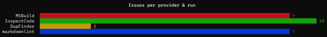

Version 0.3.0 of [Cake.Issues.Reporting.Console] has been released.
This is a minor release adding features and improvements.

<!--excerpt-->

This post shows the highlights included in this release.
For update instructions skip to [Updating from previous versions](#updating-from-previous-versions).

❤ Huge thanks to our community! This release would not have been possible without your support and contributions! ❤

People working on this release:

* [pascalberger](https://github.com/pascalberger)
* [patriksvensson](https://github.com/patriksvensson)

## Support for all Cake runners

Starting with this release [Cake.Issues.Reporting.Console] will target .NET Standard 2.0 instead of .NET 5.0 and
therefore will support all Cake runners.

## Improved reporting

Provider report is now rendered in different colors for the individual bars, making it easier to read:

## Errata 0.6.0

Underlying [Errata] library has been updated to 0.6.0, containing additional bug fixes and rendering improvements.

## Updating from previous versions

[Cake.Issues.Reporting.Console] 0.3.0 is compatible with previous versions without any breaking changes.
To update to the new version bump the version of the addin.

[Cake.Issues.Reporting.Console]: /docs/report-formats/console/
[Errata]: https://github.com/spectreconsole/errata
